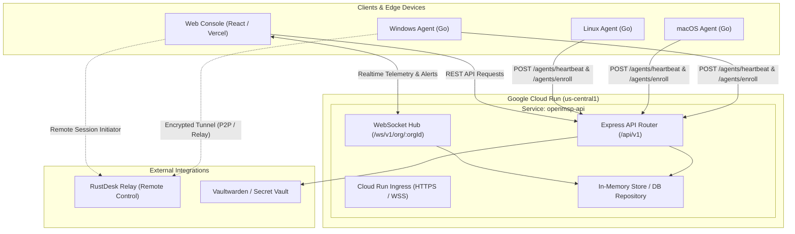

# Google Cloud Run Instance Programming & Operations Guide: OpenMSP API

This document provides complete technical specifications, architectural diagrams, API contracts, WebSocket event schemas, Go agent integration details, and DevOps operations for the **OpenMSP Control Plane API** deployed on Google Cloud Run.

---

## 1. Instance Metadata & Topology

| Parameter | Value | Notes |
|---|---|---|
| **Service Name** | `openmsp-api` | Cloud Run fully managed service |
| **GCP Project ID** | `openmsp-backend` | Google Cloud project namespace |
| **GCP Project Number** | `358737891339` | Numeric identifier |
| **Region** | `us-central1` | Iowa datacenter |
| **Public Service URL** | `https://openmsp-api-358737891339.us-central1.run.app` | Primary project-scoped endpoint |
| **Canonical URL** | `https://openmsp-api-4pqbkqafhq-uc.a.run.app` | Regional routing hash endpoint |
| **Health Check URL** | `https://openmsp-api-358737891339.us-central1.run.app/health` | Returns HTTP 200 with service timestamp |
| **WebSocket Gateway** | `wss://openmsp-api-358737891339.us-central1.run.app/ws/v1/org/:orgId` | Full-duplex realtime event streaming |
| **Service Account** | `358737891339-compute@developer.gserviceaccount.com` | Default Compute Engine runtime identity |
| **Deployer Account** | `openmsp-deployer@openmsp-backend.iam.gserviceaccount.com` | Service account with Cloud Run & Build roles |
| **Container Registry** | `us-central1-docker.pkg.dev/openmsp-backend/cloud-run-source-deploy/openmsp-api` | Artifact Registry container images |
| **Allocated vCPU** | `1.0 vCPU` (`1000m`) | Per container instance |
| **Memory Allocation** | `512 MiB` | Low-footprint Node.js runtime |
| **Concurrency** | `80` requests per instance | Maximum simultaneous requests |
| **Autoscaling Range** | `0` min to `20` max instances | Scales to zero when idle |
| **Request Timeout** | `300` seconds (5 min) | Supports persistent WebSockets & long runs |
| **Startup CPU Boost** | Enabled (`true`) | Faster cold boot times (<1.5s) |

---

## 2. Architecture & Data Flow



---

## 3. Authentication & Security Model

OpenMSP uses **JSON Web Tokens (JWT)** for user sessions and **Device Secrets / Tokens** for endpoint agents.

### User Authentication
- **Token Type**: Bearer JWT (`Authorization: Bearer <token>`)
- **Default Test Admin Account**:
  - **Email**: `admin@openmsp.local`
  - **Password**: `admin`
- **Payload Claims**:
  ```json
  {
    "id": "u-admin-01",
    "email": "admin@openmsp.local",
    "name": "System Administrator",
    "role": "superadmin",
    "orgId": "00000000-0000-0000-0000-000000000001",
    "iat": 1789260000,
    "exp": 1789864800
  }
  ```

### Device Agent Authentication
1. **Enrollment**: Agent submits an enrollment token (`tok-...` or `demo-enrollment-token-2026`).
2. **Device Secret Provisioning**: The server issues a persistent `deviceId` (e.g. `dev-mac-d0cb4f`) and a cryptographically secure `deviceSecret` (e.g. `sec-61ee4759-...`).
3. **Heartbeat Verification**: Subsequent heartbeats require both `deviceId` and `deviceSecret` in the JSON body. Requests without matching secrets receive HTTP 401 Unauthorized.

---

## 4. REST API Programming Reference

Base URL: `https://openmsp-api-358737891339.us-central1.run.app`

### 4.1 System & Health

#### Check Service Status
```http
GET /health
```
**Response (200 OK):**
```json
{
  "status": "ok",
  "service": "OpenMSP Control Plane",
  "timestamp": "2026-09-13T03:16:45.813Z"
}
```

---

### 4.2 Authentication Endpoints

#### Login
```http
POST /api/v1/auth/login
Content-Type: application/json

{
  "email": "admin@openmsp.local",
  "password": "admin"
}
```
**Response (200 OK):**
```json
{
  "token": "eyJhbGciOiJIUzI1NiIsInR5cCI6IkpXVCJ9...",
  "user": {
    "id": "u-admin-01",
    "email": "admin@openmsp.local",
    "name": "System Administrator",
    "role": "superadmin",
    "orgId": "00000000-0000-0000-0000-000000000001",
    "orgName": "Apex Technologies MSP",
    "createdAt": "2026-01-01T00:00:00.000Z"
  }
}
```

#### Current User Profile
```http
GET /api/v1/auth/me
Authorization: Bearer <TOKEN>
```

#### Logout
```http
POST /api/v1/auth/logout
Authorization: Bearer <TOKEN>
```

---

### 4.3 Agent & Device Operations

#### Agent Enrollment
```http
POST /api/v1/agents/enroll
Content-Type: application/json

{
  "token": "demo-enrollment-token-2026",
  "hostname": "PROD-DB-01",
  "os": "windows",
  "osVersion": "Windows Server 2025 Datacenter",
  "serialNumber": "VMware-42 1a 8b...",
  "macAddress": "00:50:56:a1:b2:c3",
  "ipAddress": "10.0.10.45"
}
```
**Response (201 Created):**
```json
{
  "deviceId": "dev-win-a1b2c3",
  "orgId": "00000000-0000-0000-0000-000000000001",
  "clientId": "c-acme-corp",
  "siteId": "HQ - Downtown",
  "deviceSecret": "sec-7c9e1234-5678-90ab-cdef-1234567890ab",
  "heartbeatIntervalSeconds": 30,
  "rustDeskConfig": {
    "relayServer": "relay.openmsp.local:21117",
    "idServer": "relay.openmsp.local:21116",
    "apiServer": "http://relay.openmsp.local:21114",
    "customPort": 21116,
    "key": "openmsp-demo-public-key-9a8b7c6d5e4f3a2b1",
    "onlineState": true
  }
}
```

#### Agent Heartbeat & Telemetry
```http
POST /api/v1/agents/heartbeat
Content-Type: application/json

{
  "deviceId": "dev-win-a1b2c3",
  "deviceSecret": "sec-7c9e1234-5678-90ab-cdef-1234567890ab",
  "metrics": {
    "cpuUsage": 24.5,
    "ramUsage": 62.1,
    "diskUsage": 48.0,
    "uptimeDays": 14.8
  },
  "network": {
    "ipAddress": "10.0.10.45",
    "macAddress": "00:50:56:a1:b2:c3",
    "publicIp": "198.51.100.2"
  },
  "rustDeskId": "987654321",
  "services": [
    { "name": "MSSQLSERVER", "status": "running" },
    { "name": "Spooler", "status": "running" }
  ],
  "installedApps": [
    { "name": "SQL Server 2022", "version": "16.0.1000" }
  ]
}
```
**Response (200 OK):**
```json
{
  "acknowledged": true,
  "serverTime": "2026-09-13T03:20:00.000Z",
  "pendingCommands": [
    {
      "id": "cmd-89ef21",
      "deviceId": "dev-win-a1b2c3",
      "orgId": "00000000-0000-0000-0000-000000000001",
      "commandType": "shell",
      "payload": { "command": "Get-Service MSSQLSERVER" },
      "status": "dispatched",
      "createdAt": "2026-09-13T03:19:40.000Z"
    }
  ]
}
```

#### Report Command Result
```http
POST /api/v1/agents/command-result
Content-Type: application/json

{
  "commandId": "cmd-89ef21",
  "status": "completed",
  "output": "Status: Running, Name: MSSQLSERVER, DisplayName: SQL Server",
  "error": null
}
```

---

### 4.4 Fleet & Device Management

All fleet management endpoints require `Authorization: Bearer <TOKEN>`.

| Method | Path | Description |
|---|---|---|
| `GET` | `/api/v1/devices` | Query all devices (optional: `?clientId=<id>`) |
| `GET` | `/api/v1/devices/:id` | Fetch single device details & telemetry |
| `PATCH` | `/api/v1/devices/:id` | Update device name, tags, or encryption status |
| `POST` | `/api/v1/devices/:id/commands` | Dispatch a remote command (`shell`, `script`, `restart`, `service_restart`) |
| `GET` | `/api/v1/devices/:id/commands` | Retrieve command history for a device |

#### Dispatch Command Example
```http
POST /api/v1/devices/dev-win-a1b2c3/commands
Authorization: Bearer <TOKEN>
Content-Type: application/json

{
  "commandType": "shell",
  "payload": {
    "command": "ipconfig /all"
  }
}
```

---

### 4.5 Remote Desktop & Relay

| Method | Path | Description |
|---|---|---|
| `GET` | `/api/v1/remote/config` | Get RustDesk relay configuration |
| `PATCH` | `/api/v1/remote/config` | Update relay servers or public key |
| `GET` | `/api/v1/remote/health` | Check relay status & active session counts |
| `GET` | `/api/v1/remote/sessions` | List active remote sessions |
| `POST` | `/api/v1/remote/sessions/start` | Initialize remote control session for a target device |

---

### 4.6 Agent Installer Generator

| Method | Path | Description |
|---|---|---|
| `POST` | `/api/v1/installers/token` | Create new enrollment token for client & site |
| `GET` | `/api/v1/installers/script?token=...&os=macos\|windows` | Generate automated installation one-liner script |
| `GET` | `/api/v1/installers/download?os=macos\|windows\|linux&arch=arm64\|amd64` | Download pre-compiled agent binary |

#### One-Liner Agent Deployment Examples
- **macOS / Linux**:
  ```bash
  curl -sSL "https://openmsp-api-358737891339.us-central1.run.app/api/v1/installers/script?token=demo-enrollment-token-2026&os=macos" | bash
  ```
- **Windows PowerShell**:
  ```powershell
  irm "https://openmsp-api-358737891339.us-central1.run.app/api/v1/installers/script?token=demo-enrollment-token-2026&os=windows" | iex
  ```

---

## 5. WebSocket Event Streaming Protocol

Connect via:
```
wss://openmsp-api-358737891339.us-central1.run.app/ws/v1/org/{orgId}
```

### Heartbeat & Liveness
The server responds to ping messages:
```json
// Send
{ "type": "ping" }

// Receive
{ "type": "pong", "timestamp": "2026-09-13T03:25:00.000Z" }
```

### Event Message Catalog
All broadcast events adhere to standard envelope schema:
```json
{
  "type": "<EVENT_NAME>",
  "orgId": "00000000-0000-0000-0000-000000000001",
  "timestamp": "2026-09-13T03:25:12.123Z",
  "payload": { ... }
}
```

| Event Type | Payload Schema | Description |
|---|---|---|
| `device.heartbeat` | `{ deviceId, clientId, health, metrics }` | Periodic health telemetry from agent |
| `device.health_changed` | `{ deviceId, previousHealth, currentHealth, reason }` | Fired when health state shifts (`healthy` $\to$ `warning` $\to$ `critical`) |
| `command.dispatched` | `{ commandId, deviceId, commandType }` | Sent when command is waiting for agent pickup |
| `command.updated` | `{ commandId, deviceId, status, output }` | Fired when agent reports completed execution |
| `ticket.created` | `{ ticket: ManagedTicket }` | New service desk ticket opened |
| `ticket.updated` | `{ ticket: ManagedTicket }` | Status or assignment changed |

### JavaScript / Browser Client Example
```typescript
const orgId = "00000000-0000-0000-0000-000000000001";
const ws = new WebSocket(`wss://openmsp-api-358737891339.us-central1.run.app/ws/v1/org/${orgId}`);

ws.onopen = () => {
  console.log("Connected to OpenMSP Control Plane WebSocket");
  // Periodic ping
  setInterval(() => ws.send(JSON.stringify({ type: 'ping' })), 30000);
};

ws.onmessage = (event) => {
  const msg = JSON.parse(event.data);
  switch (msg.type) {
    case 'device.heartbeat':
      updateDeviceMetrics(msg.payload);
      break;
    case 'device.health_changed':
      notifyHealthAlert(msg.payload);
      break;
    case 'command.updated':
      renderTerminalOutput(msg.payload);
      break;
  }
};
```

---

## 6. Go Agent Configuration for Cloud Run

To configure an endpoint running the OpenMSP Go Agent (`apps/agent`) to communicate with this Cloud Run instance, update `agent.json` or specify command-line arguments:

### Configuration File (`agent.json`)
```json
{
  "serverUrl": "https://openmsp-api-358737891339.us-central1.run.app",
  "token": "demo-enrollment-token-2026",
  "deviceId": "dev-mac-d0cb4f",
  "deviceSecret": "sec-61ee4759-854c-4f71-b583-61c243961b1e",
  "orgId": "00000000-0000-0000-0000-000000000001",
  "clientId": "c-acme-corp",
  "siteId": "HQ - Downtown",
  "heartbeatIntervalSeconds": 30
}
```

### Compiling Agent Binaries
Run inside `apps/agent`:
```bash
# macOS ARM64 (Apple Silicon)
CGO_ENABLED=0 GOOS=darwin GOARCH=arm64 go build -o bin/openmsp-agent-darwin-arm64 ./cmd/agent

# Windows x64
CGO_ENABLED=0 GOOS=windows GOARCH=amd64 go build -o bin/openmsp-agent-windows-amd64.exe ./cmd/agent

# Linux x64
CGO_ENABLED=0 GOOS=linux GOARCH=amd64 go build -o bin/openmsp-agent-linux-amd64 ./cmd/agent
```

---

## 7. Container Build & Deployment Pipeline

### Dockerfile Blueprint
The Cloud Run deployment uses a multi-stage Docker build with **Node.js 22 Alpine** and **pnpm@9**:

```dockerfile
FROM node:22-alpine AS builder
WORKDIR /app
RUN npm install -g pnpm@9

COPY package.json pnpm-workspace.yaml ./
COPY packages/api-types/package.json ./packages/api-types/
COPY apps/api/package.json ./apps/api/
RUN pnpm install --frozen-lockfile=false

COPY packages/api-types ./packages/api-types
COPY apps/api ./apps/api
RUN pnpm --filter @openmsp/api-types run build
RUN pnpm --filter @openmsp/api run build

FROM node:22-alpine AS runner
WORKDIR /app
ENV NODE_ENV=production
ENV PORT=8080

COPY --from=builder /app/package.json /app/pnpm-workspace.yaml ./
COPY --from=builder /app/node_modules ./node_modules
COPY --from=builder /app/packages ./packages
COPY --from=builder /app/apps/api ./apps/api

WORKDIR /app/apps/api
EXPOSE 8080
CMD ["node", "dist/server.js"]
```

> [!NOTE]
> `pnpm@9` is specifically required. `pnpm@10+` disables esbuild build scripts by default, which causes TypeScript build steps to fail.

---

## 8. Operational & DevOps Commands (`gcloud`)

All commands use the authenticated Google Cloud SDK at `~/.local/bin/gcloud`.

### 1. Deploy Code Updates
To build and deploy new changes to Cloud Run from the repo root:
```bash
~/.local/bin/gcloud run deploy openmsp-api \
  --source . \
  --project=openmsp-backend \
  --region=us-central1 \
  --allow-unauthenticated \
  --quiet
```

### 2. Stream Live Server Logs
To tail application logs in real-time:
```bash
~/.local/bin/gcloud run services logs tail openmsp-api \
  --project=openmsp-backend \
  --region=us-central1
```

### 3. Read Recent Log Entries
```bash
~/.local/bin/gcloud run services logs read openmsp-api \
  --project=openmsp-backend \
  --region=us-central1 \
  --limit=50
```

### 4. Inspect Service Configuration
```bash
~/.local/bin/gcloud run services describe openmsp-api \
  --project=openmsp-backend \
  --region=us-central1
```

### 5. Update Environment Variables
```bash
~/.local/bin/gcloud run services update openmsp-api \
  --set-env-vars="JWT_SECRET=your_new_secret_key,PORT=8080" \
  --project=openmsp-backend \
  --region=us-central1 \
  --quiet
```

### 6. Rollback to Previous Revision
To list revisions and route 100% traffic to a previous stable revision:
```bash
# List revisions
~/.local/bin/gcloud run revisions list --service=openmsp-api --project=openmsp-backend --region=us-central1

# Route traffic to specific revision
~/.local/bin/gcloud run services update-traffic openmsp-api \
  --to-revisions=openmsp-api-00003-jb7=100 \
  --project=openmsp-backend \
  --region=us-central1 \
  --quiet
```

---

## 9. Frontend & Vercel Integration

The React UI hosted at `https://openmsp.vercel.app` is pre-configured to communicate directly with this Cloud Run backend.

- In `apps/console/.env.production`:
  ```ini
  VITE_API_URL=https://openmsp-api-358737891339.us-central1.run.app
  ```
- The frontend client service (`apps/console/src/services/api.ts`) automatically transforms `https://` into `wss://` when initiating WebSocket connections:
  ```typescript
  const WS_URL = API_URL.replace(/^http/, 'ws');
  ```
